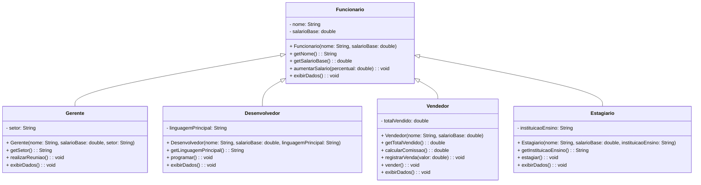

```mermaid
classDiagram
    class Funcionario {
        - nome: String
        - salarioBase: double
        + Funcionario(nome: String, salarioBase: double)
        + getNome(): String
        + getSalarioBase(): double
        + aumentarSalario(percentual: double): void
        + exibirDados(): void
    }

    class Gerente {
        - setor: String
        + Gerente(nome: String, salarioBase: double, setor: String)
        + getSetor(): String
        + realizarReuniao(): void
        + exibirDados(): void
    }

    class Desenvolvedor {
        - linguagemPrincipal: String
        + Desenvolvedor(nome: String, salarioBase: double, linguagemPrincipal: String)
        + getLinguagemPrincipal(): String
        + programar(): void
        + exibirDados(): void
    }

    class Vendedor {
        - totalVendido: double
        + Vendedor(nome: String, salarioBase: double)
        + getTotalVendido(): double
        + calcularComissao(): double
        + registrarVenda(valor: double): void
        + vender(): void
        + exibirDados(): void
    }

    class Estagiario {
        - instituicaoEnsino: String
        + Estagiario(nome: String, salarioBase: double, instituicaoEnsino: String)
        + getInstituicaoEnsino(): String
        + estagiar(): void
        + exibirDados(): void
    }

    Funcionario <|-- Gerente
    Funcionario <|-- Desenvolvedor
    Funcionario <|-- Vendedor
    Funcionario <|-- Estagiario
```
